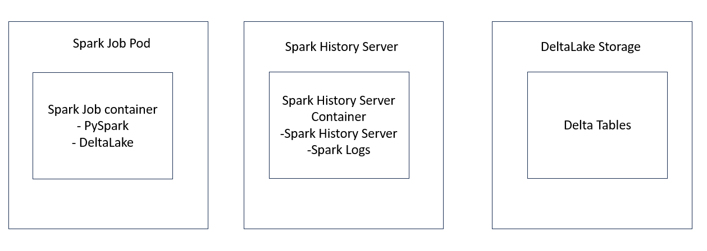

```markdown
# Data Engineer Task 2

This project is a Spark job that ingests one or multiple CSV files into DeltaLake. The job is designed to handle files with and without headers. It adds two extra columns to the output DataFrame: `ingestion_tms` (ingestion timestamp) and `batch_id` (UUID v4). The job uses APPEND write mode to atomically add new data to the Delta table.

## Requirements

- Python 3
- PySpark 3.3.1
- DeltaLake 1.2.1

## Usage

1. Clone the repository to your local machine.
2. Navigate to the project directory.
3. Run the Docker Compose file to start the Spark job and the Spark History Server:

```bash
docker-compose up -d
```

## Deployment Diagram:



1. Spark Job Pod:

- Contains the Spark Job container with PySpark and DeltaLake dependencies.
- Executes the Spark Job to ingest and transform data.
- Adds extra columns to the DataFrame.
- Writes data to DeltaLake in APPEND mode.

2. Spark History Server:

- Runs in its own container alongside the Spark Job.
- Monitors and serves historical Spark application data, logs, and traces.
- Uses the specified image and command for configuration.

3. DeltaLake Storage:

- Represents the storage backend for DeltaLake.
- Could be a cloud-based storage service (Amazon S3) or local storage.
- Stores the ingested and transformed data.